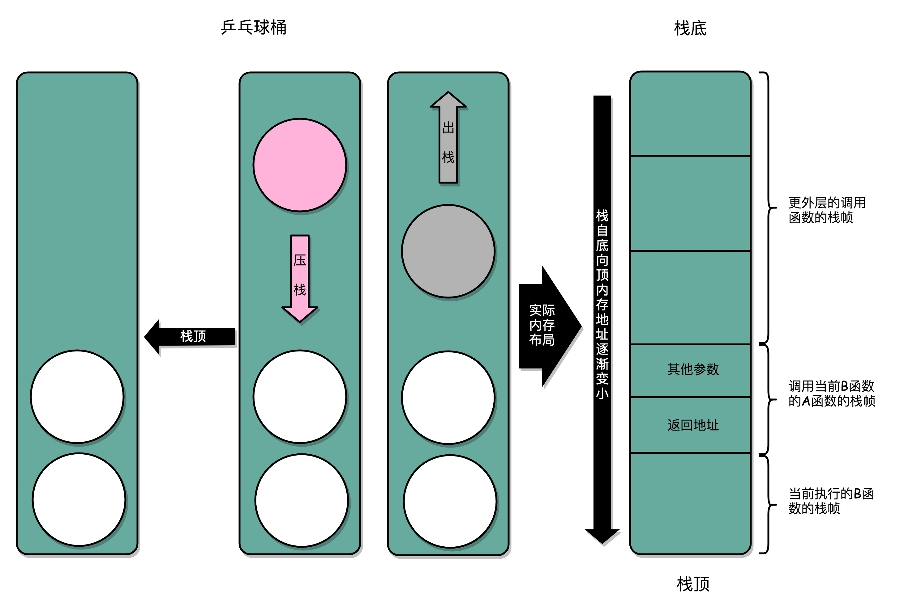

### 函数调用：为什么会发生stack orverflow?

实际上，栈底的内存地址是在一开始就固定的。而一层一层压栈之后，栈顶的的内存地址是在逐渐变小而不是变大。

通过内联优化并不是没有代价，如果一个函数在很多地方都被调用了，那么就会展开很多次，整个程序占用的空间就会变大了。没有调用其他函数，只会被调用的函数，我们一般称为叶子函数（或叶子过程）

问：在程序栈里面，处理我们跳转前的指令地址外，还需要保留哪些信息，才能在我们在函数调用完成之后，跳转回到指令地址的时候，继续执行完函数调用之后的指令呢？

​	

